## 1. 전체 클래스 다이어그램

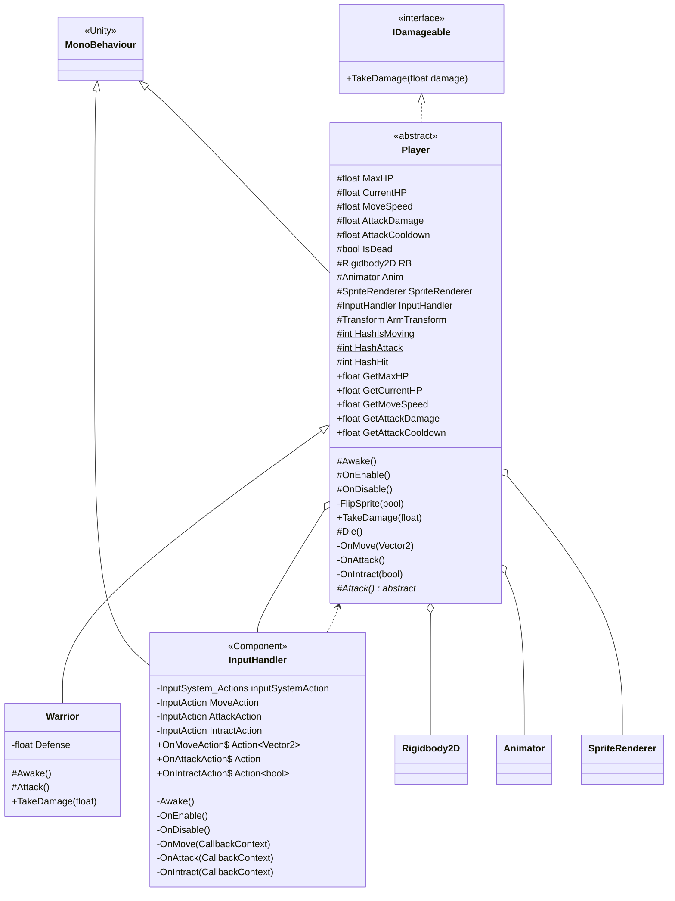

---

## 2. 상속 계층 구조

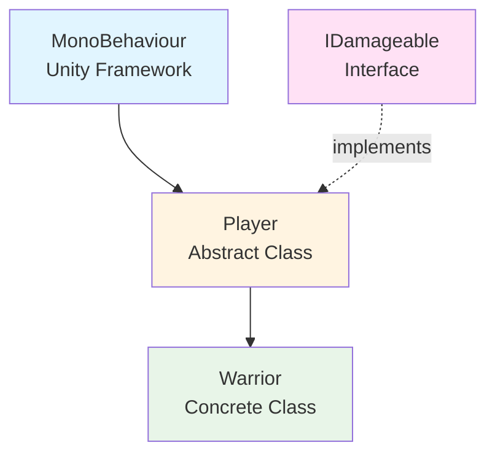

---

## 3. 메서드 오버라이딩 관계

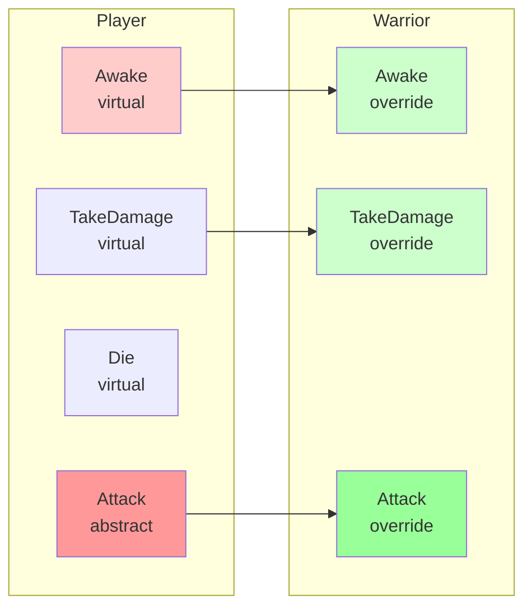

---

## 4. 이벤트 흐름도

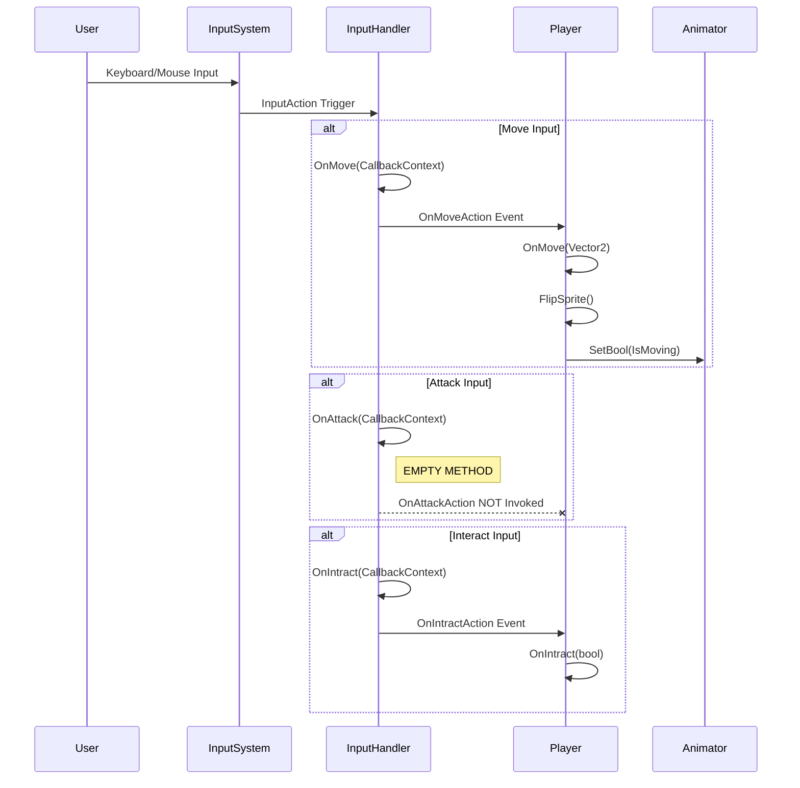

---

## 5. 컴포넌트 의존성

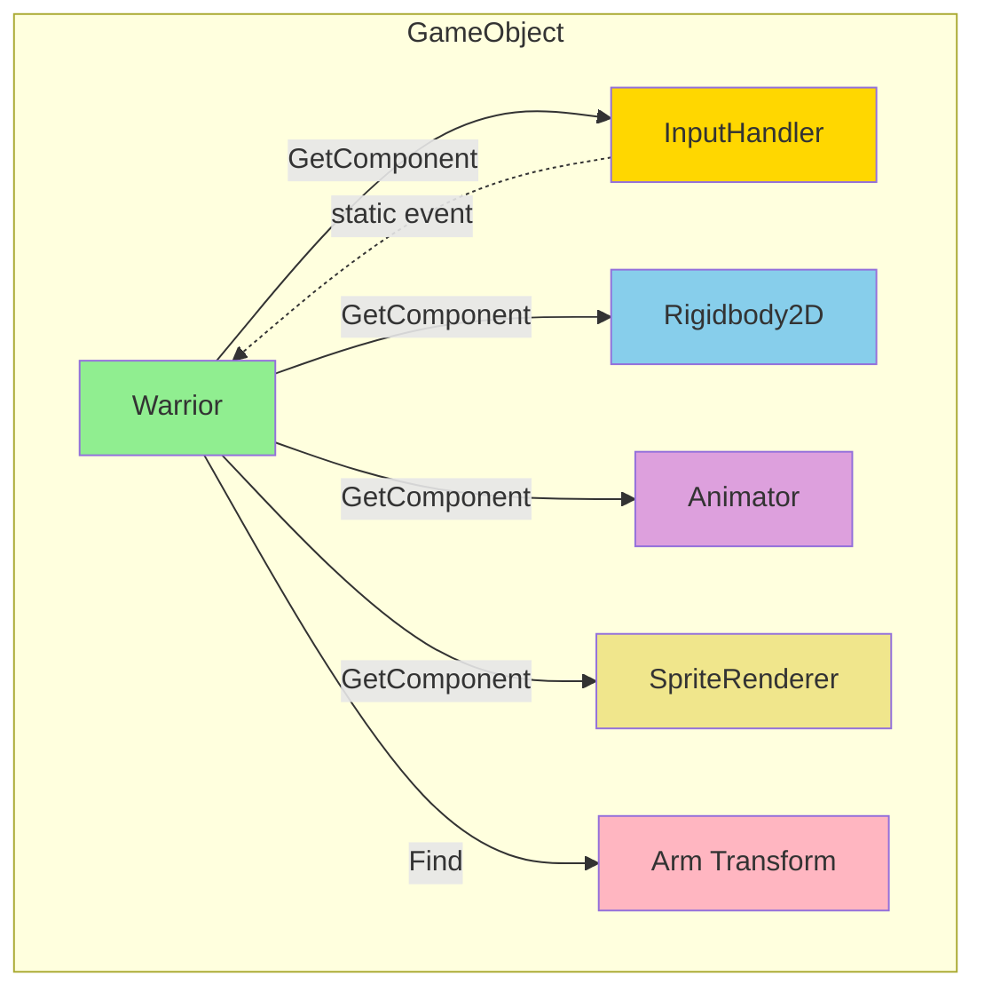

---

## 6. 생명주기 다이어그램

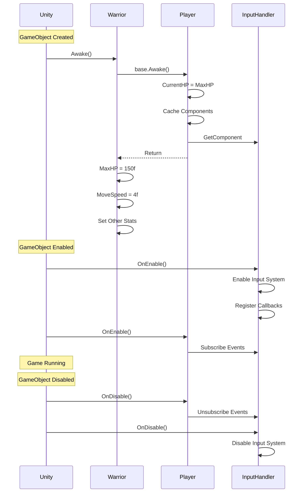

---

## 7. 데미지 처리 흐름

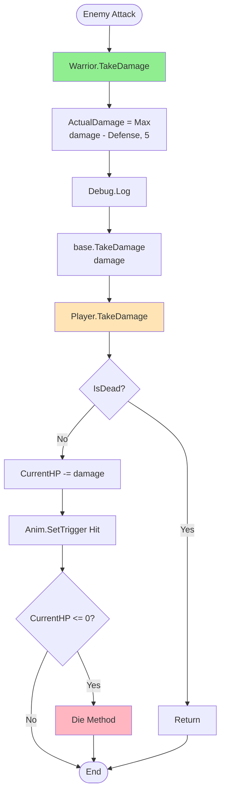

---

## 8. 스탯 초기화 흐름

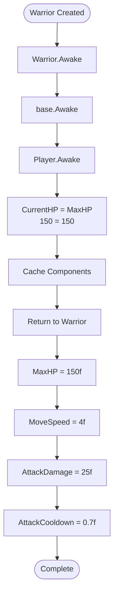

---

## 9. RequireComponent 의존성

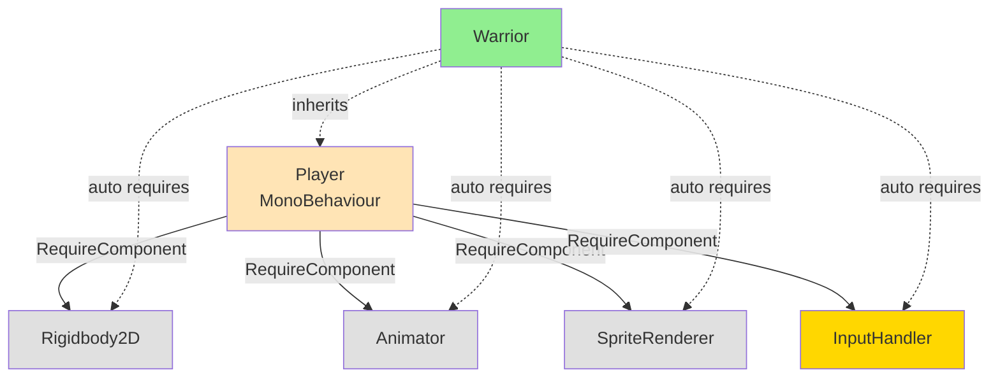

---

## 10. 공격 시나리오

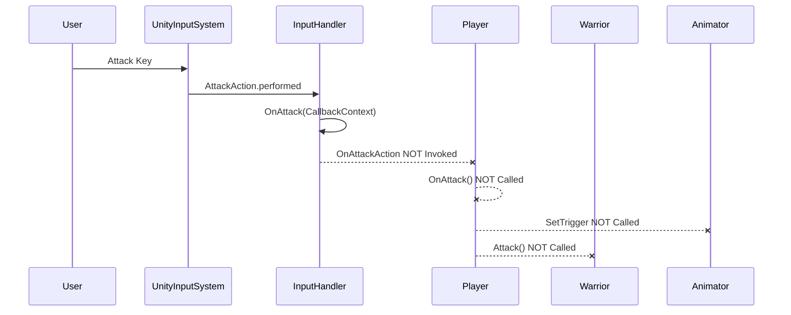

---

## 11. 데미지 처리 시나리오

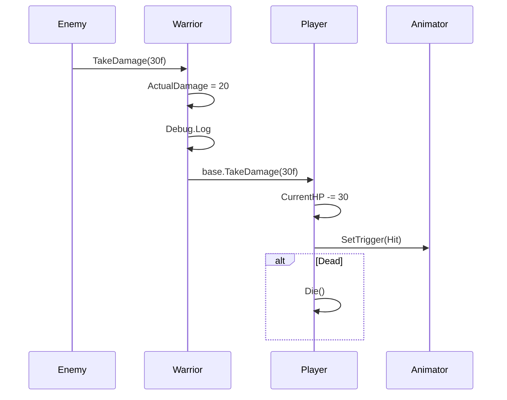

---

## 12. 이벤트 구독 관계도

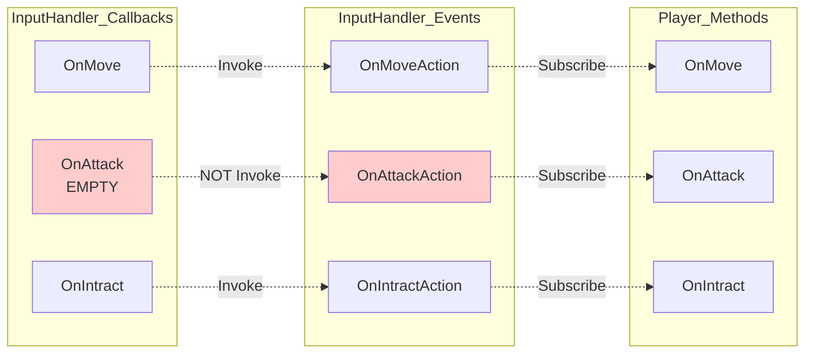

---

## 13. 추상화 레벨

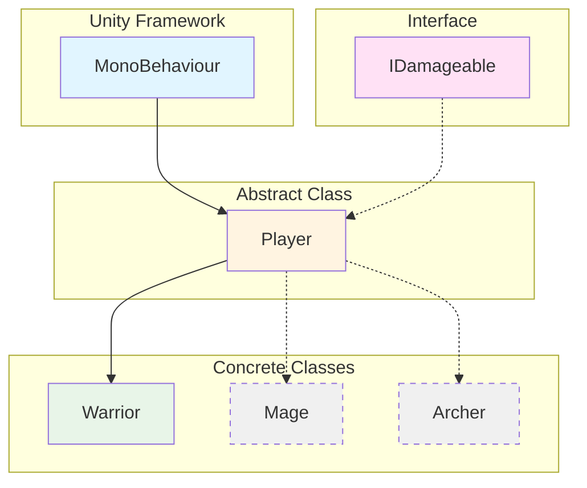

---

## 14. 확장 가능성

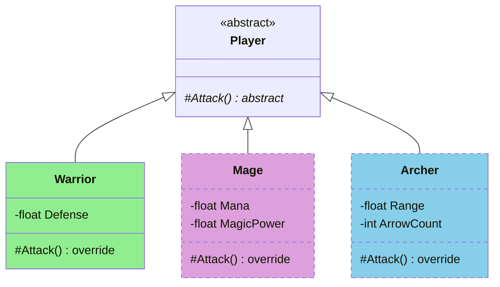

---

## 15. 상세 클래스 다이어그램

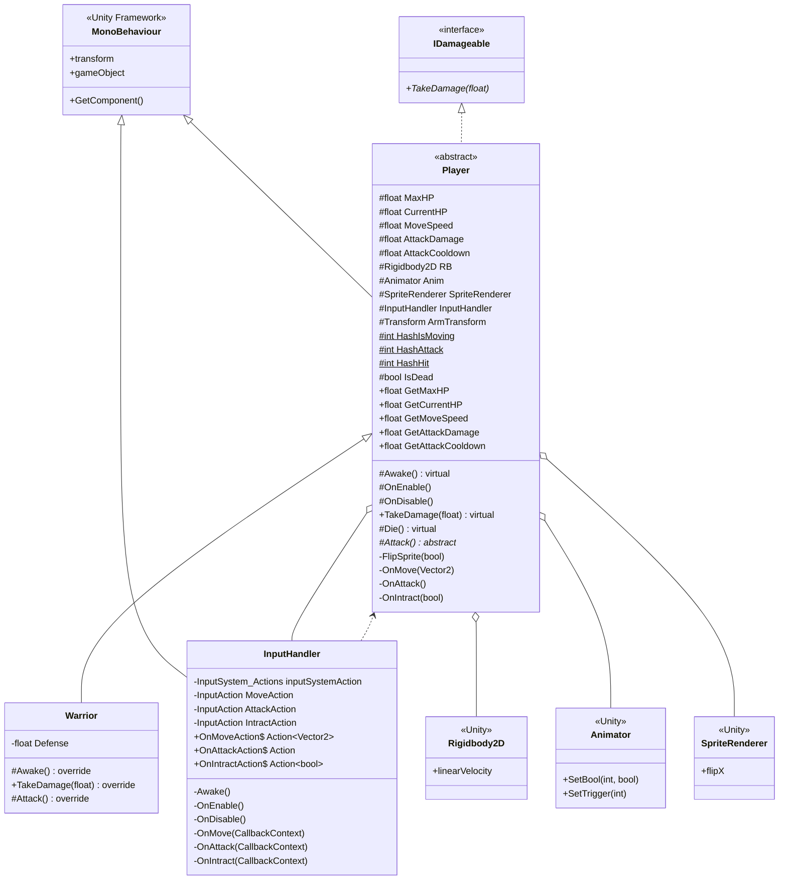

---

## 16. 이벤트 흐름도


---

## 17. 컴포넌트 의존성


---

## 18. 생명주기 다이어그램


---

## 19. 데미지 처리 흐름


---

## 20. 스탯 초기화 흐름


---

## 21. RequireComponent 의존성

```mermaid
graph TB
    P[Player<br/>MonoBehaviour]
    
    P -->|RequireComponent| RB[Rigidbody2D]
    P -->|RequireComponent| AN[Animator]
    P -->|RequireComponent| SR[SpriteRenderer]
    P -->|RequireComponent| IH[InputHandler]
    
    W[Warrior]
    W -.inherits.-> P
    W -.auto requires.-> RB
    W -.auto requires.-> AN
    W -.auto requires.-> SR
    W -.auto requires.-> IH
    
    style P fill:#FFE4B5
    style W fill:#90EE90
    style RB fill:#E0E0E0
    style AN fill:#E0E0E0
    style SR fill:#E0E0E0
    style IH fill:#FFD700
```

---

## 22. 공격 시나리오

```mermaid
sequenceDiagram
    participant User
    participant UnityInputSystem
    participant InputHandler
    participant Player
    participant Warrior
    participant Animator
    
    User->>UnityInputSystem: Attack Key
    UnityInputSystem->>InputHandler: AttackAction.performed
    InputHandler->>InputHandler: OnAttack(CallbackContext)
    InputHandler--xPlayer: OnAttackAction NOT Invoked
    Player--xPlayer: OnAttack() NOT Called
    Player--xAnimator: SetTrigger NOT Called
    Player--xWarrior: Attack() NOT Called
```

---

## 23. 데미지 처리 시나리오

```mermaid
sequenceDiagram
    participant Enemy
    participant Warrior
    participant Player
    participant Animator
    
    Enemy->>Warrior: TakeDamage(30f)
    Warrior->>Warrior: ActualDamage = 20
    Warrior->>Warrior: Debug.Log
    Warrior->>Player: base.TakeDamage(30f)
    Player->>Player: CurrentHP -= 30
    Player->>Animator: SetTrigger(Hit)
    
    alt Dead
        Player->>Player: Die()
    end
```

---

## 24. 이벤트 구독 관계도

```mermaid
graph LR
    subgraph InputHandler_Events
        E1[OnMoveAction]
        E2[OnAttackAction]
        E3[OnIntractAction]
    end
    
    subgraph Player_Methods
        M1[OnMove]
        M2[OnAttack]
        M3[OnIntract]
    end
    
    subgraph InputHandler_Callbacks
        C1[OnMove]
        C2[OnAttack<br/>EMPTY]
        C3[OnIntract]
    end
    
    C1 -.Invoke.-> E1
    C2 -.NOT Invoke.-> E2
    C3 -.Invoke.-> E3
    
    E1 -.Subscribe.-> M1
    E2 -.Subscribe.-> M2
    E3 -.Subscribe.-> M3
    
    style C2 fill:#ffcccc
    style E2 fill:#ffcccc
```

---

## 25. 추상화 레벨

```mermaid
graph TB
    subgraph Level_0["Unity Framework"]
        MB[MonoBehaviour]
    end
    
    subgraph Level_1["Interface"]
        ID[IDamageable]
    end
    
    subgraph Level_2["Abstract Class"]
        P[Player]
    end
    
    subgraph Level_3["Concrete Classes"]
        W[Warrior]
        M[Mage]
        Ar[Archer]
    end
    
    MB --> P
    ID -.-> P
    P --> W
    P -.-> M
    P -.-> Ar
    
    style MB fill:#e1f5ff
    style ID fill:#ffe1f5
    style P fill:#fff4e1
    style W fill:#e8f5e8
    style M fill:#f0f0f0,stroke-dasharray: 5 5
    style Ar fill:#f0f0f0,stroke-dasharray: 5 5
```

---

## 26. 확장 가능성

```mermaid
classDiagram
    class Player {
        <<abstract>>
        #Attack()* abstract
    }
    
    class Warrior {
        -float Defense
        #Attack() override
    }
    
    class Mage {
        -float Mana
        -float MagicPower
        #Attack() override
    }
    
    class Archer {
        -float Range
        -int ArrowCount
        #Attack() override
    }
    
    Player <|-- Warrior
    Player <|-- Mage
    Player <|-- Archer
    
    style Warrior fill:#90EE90
    style Mage fill:#DDA0DD,stroke-dasharray: 5 5
    style Archer fill:#87CEEB,stroke-dasharray: 5 5